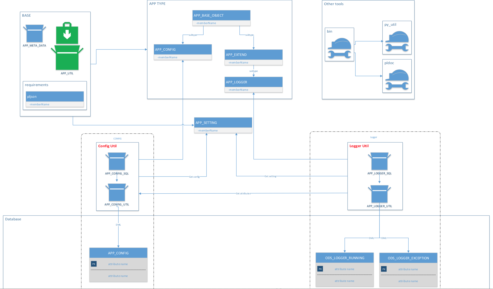

# app_util

Description: this tool is used to track history of PL/SQL units, such as procedure, query, application like APEX... It will measure running timing, catch exception and save into table in Oracle database.

Sample here: ./pl_util/samples/logger.sql

Tracking procedure processing. Architecture:

